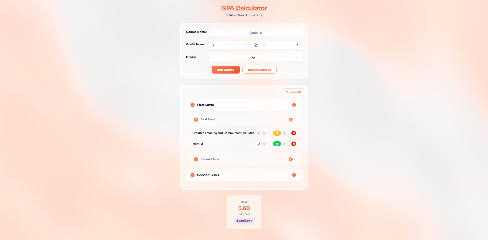

# GPA Calculator for FCAI — Cairo University

**Your GPA, one tap away.**  
A modern, friendly calculator built for Faculty of Computer and Artificial Intelligence (FCAI) students at Cairo University. Add courses, pick grades, see your GPA update in real time — and get a clear picture of where you stand.



---

## ✨ What you get

- **Add courses in seconds** — Type a course code or name and get suggestions; credit hours and names fill in automatically.
- **Letter grades A+ to F** — Choose your grade; the app uses the official FCAI 4.0 scale.
- **Smooth credit-hour picker** — A neat rotating control (0–3 hours) with clear animations.
- **Live GPA** — Your GPA updates as you add or change courses, with a simple “Excellent / Good / Acceptable” style label.
- **Import from the portal** — Paste your registered courses from the FCAI portal and let the app sort them by level and term.
- **Groups that make sense** — Courses grouped by level and term; expand or collapse and see group stats (GPA, credits, pass/fail).
- **Undo “Clear All”** — Cleared everything by mistake? A short countdown bar lets you bring your list back with one click.
- **English & Arabic** — Switch language with the globe icon; the app supports Egyptian Arabic (ar-EG) with the right fonts.
- **Stays on your device** — Your courses and preferences are saved in your browser so you can pick up where you left off.
- **Looks good everywhere** — Clean, glass-style UI and a subtle animated background; works on phones and desktops.
- **Safe actions** — Confirm before resetting; no surprise data loss.

---

## 🚀 Try it

**Live app:** [**https://gpa.zokm.me**](https://gpa.zokm.me)  

---

## 📖 How to use

Click the **How to** button (top left on the [site](https://gpa.zokm.me)) for the full step-by-step guide.

---

## 👩‍💻 For developers

Setup, project structure, components, and technical specs are in **[TECHNICAL.md](TECHNICAL.md)**.

---

## 🤝 Contributing

Ideas and pull requests are welcome. Fork the repo, open a branch, and send a PR.

### Quality checks

Run the full pipeline locally before opening a PR:

```bash
npm ci
npm run ci
```

Individual commands:

| Command | Purpose |
|---------|---------|
| `npm run audit` | Security audit (fails on any vulnerability) |
| `npm run lint` | ESLint with zero warnings allowed |
| `npm run typecheck` | TypeScript strict check |
| `npm run test` | Unit and component tests (Vitest) |
| `npm run test:e2e` | Smoke E2E tests (Playwright) |
| `npm run build` | Production build |

CI runs automatically on pull requests and pushes to `main`.

---

## 📄 License

MIT — see the [LICENSE](LICENSE) file.

---

*Made for FCAI — Cairo University students*
