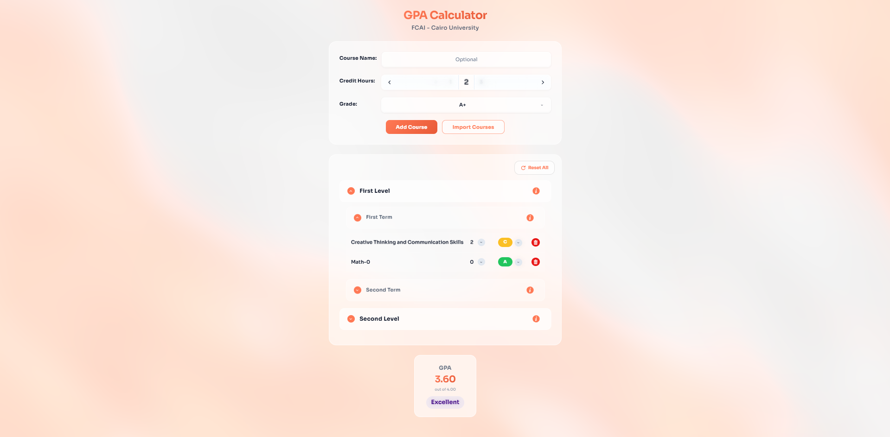

# GPA Calculator for FCAI - Cairo University

**Your GPA, one tap away.**  
A modern, friendly calculator built for Faculty of Computer and Artificial Intelligence (FCAI) students at Cairo University. Add courses, pick grades, see your GPA update in real time - and get a clear picture of where you stand.

Now fully supports the new college website portal: [**MyU** (https://myu.cu.edu.eg/)](https://myu.cu.edu.eg/).



---

## ✨ What you get

- **Add courses in seconds** - Type a course code or name and get suggestions; credit hours and names fill in automatically.
- **Letter grades A+ to F** - Choose your grade; the app uses the official FCAI 4.0 scale.
- **Smooth credit-hour picker** - A neat rotating control (0-3 hours) with clear animations.
- **Live GPA** - Your GPA updates as you add or change courses, with a simple “Excellent / Good / Acceptable” style label.
- **Import from the new college portal** - Fully supports the new college website portal ([**MyU**](https://myu.cu.edu.eg/) - [https://myu.cu.edu.eg/](https://myu.cu.edu.eg/)). Simply log in to your college account, navigate to **Course Grades**, copy the HTML, and let the app instantly parse and group all your semesters, courses, and grades.
- **Groups that make sense** - Courses grouped by level and term; expand or collapse and see group stats (GPA, credits, pass/fail).
- **Undo “Clear All”** - Cleared everything by mistake? A short countdown bar lets you bring your list back with one click.
- **Live College Portal Status** - An indicator shows whether the college portal ([https://myu.cu.edu.eg/](https://myu.cu.edu.eg/)) is online or experiencing downtime.
- **English & Arabic** - Switch language with the globe icon; the app supports Egyptian Arabic (ar-EG) with the right fonts.
- **Stays on your device** - Your courses and preferences are saved in your browser so you can pick up where you left off.
- **Looks good everywhere** - Clean, glass-style UI and a subtle animated background; works on phones and desktops.
- **Safe actions** - Confirm before resetting; no surprise data loss.

---

## 🚀 Try it

**Live app:** [**https://gpa.zokm.me**](https://gpa.zokm.me)  

---

## 📖 How to use

1. Open the [**MyU College Portal**](https://myu.cu.edu.eg/) ([https://myu.cu.edu.eg/](https://myu.cu.edu.eg/)).
2. Log in to your college account and head to **Course Grades**.
3. Copy the HTML from the page (using the Copy HTML browser extension on Desktop/Lemur or the iOS Shortcut).
4. Click **Import Courses** on the [GPA Calculator](https://gpa.zokm.me), paste the HTML, and click Import!

Click the **How to** button (top left on the site) for device-specific step-by-step instructions (Desktop, Android, and iOS).

---

## 👩‍💻 For developers

Setup, project structure, components, and technical specs are in **[TECHNICAL.md](TECHNICAL.md)**.

### Analytics

The production site uses **Google Analytics 4** to understand usage and improve the app. Your courses stay in the browser; we do **not** send course names, student IDs, or pasted import HTML. After each **successful HTML import**, one event includes the **overall GPA** (two decimals) computed from that import. Other events cover things like import success/failure, language, and UI actions - without academic identifiers.

Full details: **[docs/PRIVACY.md](docs/PRIVACY.md)**.

---

## 🤝 Contributing

Ideas and pull requests are welcome. Fork the repo, open a branch, and send a PR.

### Quality checks

Run the full pipeline locally before opening a PR:

```bash
npm ci
npm run ci
```

Individual commands:

| Command | Purpose |
|---------|---------|
| `npm run audit` | Security audit (fails on any vulnerability) |
| `npm run lint` | ESLint with zero warnings allowed |
| `npm run typecheck` | TypeScript strict check |
| `npm run test` | Unit and component tests (Vitest) |
| `npm run test:e2e` | Smoke E2E tests (Playwright) |
| `npm run build` | Production build |

CI runs automatically on pull requests and pushes to `main`.

---

## 📄 License

MIT - see the [LICENSE](LICENSE) file.

---

*Made for FCAI - Cairo University students*
