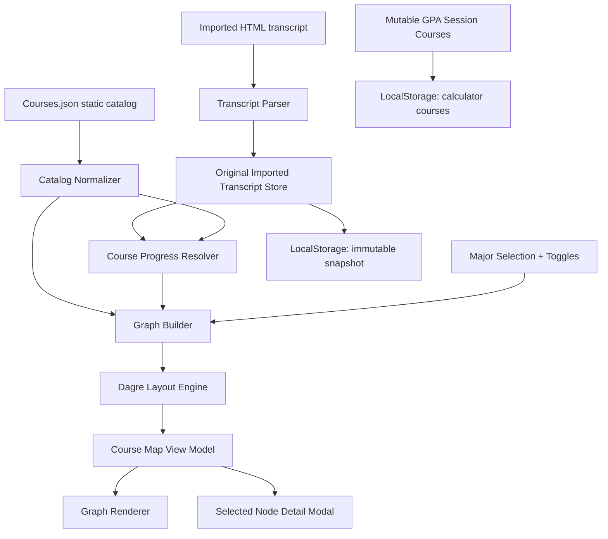

# Course Map Feature: Functional & Architectural Plan

## 1. Objective

Build an interactive, node-based "Course Map" that visualizes the FCAI curriculum as a directed graph:

- **Nodes** represent catalog courses from `Courses.json`.
- **Edges** represent prerequisites and credit-hour gates.
- **Progress state** comes strictly from the user's originally imported HTML transcript snapshot.
- **Session GPA what-if changes** must not affect Course Map progress, availability, conformance, or modal status.
- **Major selection** controls which part of the curriculum is visible.
- **General courses** follow the dynamic "General Rule": show General + Major until General is complete, then hide General and show only Major.

This plan intentionally avoids UI component implementation. It focuses on data contracts, state ownership, algorithms, persistence, and graph construction.

## 2. Existing System Context

Current relevant app behavior:

- `app/page.tsx` owns the main `courses: Course[]` state.
- `src/components/ImportModal.tsx` parses pasted FCAI portal HTML into `Course[]`.
- `STORAGE_KEYS.COURSES` stores the active course list in localStorage under `gpa-persist-v1-courses`.
- Imported courses are currently marked with `isImported: true`.
- Manual additions and grade/credit edits mutate the same `Course[]` used for GPA calculations.
- Current `Course` type is minimal:

```ts
export interface Course {
  id?: string
  name: string
  hours: number
  grade: Grade | null
  term?: Term
  level?: Level
  isImported?: boolean
}
```

The Course Map must split this into two conceptual streams:

- **Immutable transcript snapshot:** original imported HTML-derived academic record.
- **Mutable session working set:** current GPA calculator courses after what-if edits.

## 3. High-Level Architecture



Architectural separation:

- **Catalog layer:** pure static transformations from `Courses.json`.
- **Transcript layer:** immutable user academic record derived from original import.
- **Progress layer:** cross-reference catalog courses with immutable transcript entries.
- **Graph layer:** transform filtered catalog and progress into nodes, edges, and layout coordinates.
- **Presentation layer:** graph renderer and modal consume already-computed view models.

## 4. Source Data Contracts

### 4.1 Static Course Catalog

Current `src/data/Courses.json` top-level structure:

```ts
interface CourseCatalogFile {
  university: string
  faculty: string
  program_requirements: {
    general_requirements: RequirementGroup
    university_requirements_no_credit: RequirementGroup
    college_requirements: RequirementGroup
  }
  majors: Record<MajorKey, MajorDefinition>
}
```

Known current major keys:

```ts
type MajorKey =
  | 'Computer_Science'
  | 'Information_Technology'
  | 'Information_Systems'
  | 'Decision_Support_and_Operations_Research'
  | 'Artificial_Intelligence'
```

Current course entries are nested under arbitrary requirement-group keys such as:

- `program_requirements.general_requirements.mandatory.courses`
- `program_requirements.general_requirements.elective.courses`
- `program_requirements.college_requirements.basic_computer_science.courses`
- `majors.Computer_Science.major_requirements.applied_sciences_mandatory.courses`

Plan: introduce a catalog normalizer that recursively walks `Courses.json` and emits flat, typed course records with category metadata.

### 4.2 Normalized Catalog Course

```ts
type RequirementScope =
  | 'general'
  | 'university_no_credit'
  | 'college'
  | 'major'

type RequirementType = 'Mandatory' | 'Elective'

interface CatalogCourse {
  code: string
  name: string
  creditHours: number
  prerequisites: RawPrerequisite[]
  type: RequirementType
  description?: string
  catalogId?: number

  scope: RequirementScope
  majorKey?: MajorKey
  requirementPath: string[]
  requirementTitlePath: string[]
  requirementCreditHours?: number

  // Derived by normalizer
  canonicalCode: string
  canonicalName: string
  searchTokens: string[]
}
```

Normalization rules:

- `canonicalCode = code.trim().toUpperCase()`.
- `canonicalName = normalizeCourseName(name)`.
- Duplicate `code` records should be merged only when the payload is equivalent; otherwise keep separate entries with `requirementPath` provenance and log a catalog warning.
- A course can appear in multiple scopes/majors; store a single `CatalogCourseEntity` plus many `CatalogCourseMembership`s if duplicate membership becomes common.

### 4.3 Raw and Parsed Prerequisites

Current JSON stores prerequisites as arrays of strings, e.g.:

```json
["CS112"]
["Passing 30 Credit Hours"]
["DS321", "ST222"]
```

Future-proof data model:

```ts
type RawPrerequisite = string

type PrerequisiteExpression =
  | { kind: 'none' }
  | { kind: 'course'; courseCode: string }
  | { kind: 'creditHours'; minimumPassedCredits: number }
  | { kind: 'and'; all: PrerequisiteExpression[] }
  | { kind: 'or'; any: PrerequisiteExpression[] }
  | { kind: 'unknown'; raw: string; reason: string }
```

Default interpretation for current data:

- Empty array => `{ kind: 'none' }`.
- Array entries are **AND** conditions unless an entry contains an explicit OR marker.
- A plain course-like token (`CS112`, `MA113`) => course prerequisite.
- `Passing 30 Credit Hours` => credit-hour gate.
- Strings such as `Critical Thinking` that do not match a known course code should be resolved by name lookup. If unresolved, mark as `unknown`.

## 5. Transcript Data Model

### 5.1 Core Constraint

The Course Map must use **only the originally imported HTML data**. It must not use:

- Manual courses added after import.
- Grade changes made in the GPA calculator.
- Credit-hour tweaks made in the GPA calculator.
- Removed rows from the current session.
- Any undo/clear changes unless the user explicitly re-imports a new transcript.

### 5.2 Immutable Import Snapshot

Add a new stable storage key:

```ts
export const STORAGE_KEYS = {
  COURSES: 'gpa-persist-v1-courses',
  GROUP_STATES: 'gpa-persist-v1-group-states',
  LOCALE: 'gpa-persist-v1-locale',
  ORIGINAL_IMPORTED_TRANSCRIPT: 'gpa-persist-v1-original-imported-transcript',
} as const
```

Store the original import snapshot separately from `COURSES`.

```ts
interface OriginalImportedTranscript {
  schemaVersion: 1
  importId: string
  importedAt: string
  source: 'fcai-html'
  rawHtmlHash: string
  parserVersion: string
  entries: TranscriptEntry[]
  parseWarnings: TranscriptParseWarning[]
}

interface TranscriptEntry {
  id: string
  originalRowIndex: number
  source: 'imported-html'

  // Raw extracted fields
  rawName: string
  rawCreditHours: string
  rawGrade: string | null
  rawLevel?: string
  rawTerm?: string

  // Normalized fields
  name: string
  canonicalName: string
  matchedCourseCode?: string
  matchedCourseConfidence: 'exact-code' | 'exact-name' | 'normalized-name' | 'manual-review' | 'unmatched'
  hours: number
  grade: Grade | null
  level?: Level
  term?: Term

  // Derived transcript status
  status: TranscriptCourseStatus
}

type TranscriptCourseStatus =
  | 'completed'
  | 'in_progress'
  | 'failed'
  | 'withdrawn_or_unknown'

interface TranscriptParseWarning {
  rowIndex?: number
  code?: string
  message: string
  rawValue?: string
}
```

### 5.3 Session-Modified GPA Data

Keep current `STORAGE_KEYS.COURSES` as the mutable GPA calculator session:

```ts
interface SessionModifiedCourse extends Course {
  sourceTranscriptEntryId?: string
  originalImportId?: string
  modifiedFields?: Array<'grade' | 'hours' | 'name' | 'removed' | 'manual'>
}
```

On import:

1. Parse HTML into immutable `OriginalImportedTranscript`.
2. Convert transcript entries into the current `Course[]` shape for GPA UI.
3. Store immutable transcript at `ORIGINAL_IMPORTED_TRANSCRIPT`.
4. Store session courses at `COURSES`.

When users edit grades/hours in the GPA calculator:

- Update only `COURSES`.
- Never mutate `ORIGINAL_IMPORTED_TRANSCRIPT`.
- Optionally record `modifiedFields` in `COURSES` for UI transparency.

When users re-import:

- Create a new `OriginalImportedTranscript` snapshot.
- Replace `ORIGINAL_IMPORTED_TRANSCRIPT`.
- Replace `COURSES` with fresh session courses, matching current behavior.

## 6. State Management Strategy

### 6.1 Recommendation

Use a small dedicated external store such as **Zustand** for Course Map state, while keeping existing calculator state in `app/page.tsx` initially.

Why Zustand over Context-only:

- Graph view has independent, derived-heavy state: selected major, selected node, filters, layout cache, warnings.
- Avoids prop drilling through graph controls, canvas, minimap, and modal.
- Enables memoized selectors for expensive graph generation.
- Easier to persist selected major/toggles without coupling to GPA course state.

Context-only is acceptable for an MVP if the graph is isolated, but Course Map has enough independent state and derived selectors to justify a store.

### 6.2 Store Shape

```ts
interface CourseMapStoreState {
  selectedMajor: MajorKey | null
  showCompletedCourses: boolean
  selectedNodeId: string | null

  catalog: NormalizedCatalog | null
  transcript: OriginalImportedTranscript | null

  graphInputHash: string | null
  layoutCache: Record<string, LayoutResult>
  diagnostics: CourseMapDiagnostic[]

  setSelectedMajor(major: MajorKey): void
  setShowCompletedCourses(show: boolean): void
  selectNode(nodeId: string | null): void
  hydrateFromStorage(): void
  refreshCatalog(catalog: NormalizedCatalog): void
}
```

### 6.3 Persistence Boundaries

Persist:

- `selectedMajor` as `gpa-persist-v1-course-map-selected-major`.
- `showCompletedCourses` as `gpa-persist-v1-course-map-show-completed`.
- Immutable transcript snapshot as described above.

Do not persist:

- Computed nodes/edges.
- Dagre coordinates.
- Selected node payload.
- Diagnostics that can be recomputed.

Reason: catalog and transcript are the sources of truth; graph output should be deterministic.

## 7. Catalog Normalization Algorithm

### 7.1 Goal

Convert nested `Courses.json` into:

```ts
interface NormalizedCatalog {
  byCode: Record<string, CatalogCourse>
  byCanonicalName: Record<string, CatalogCourse[]>
  memberships: CatalogCourseMembership[]
  majorKeys: MajorKey[]
  diagnostics: CatalogDiagnostic[]
}

interface CatalogCourseMembership {
  courseCode: string
  scope: RequirementScope
  majorKey?: MajorKey
  requirementPath: string[]
  requirementTitlePath: string[]
  type: RequirementType
}
```

### 7.2 Steps

1. Load `Courses.json`.
2. Walk `program_requirements`.
3. For each object containing a `courses` array:
   - Infer scope from root path:
     - `general_requirements` => `general`
     - `university_requirements_no_credit` => `university_no_credit`
     - `college_requirements` => `college`
   - Emit `CatalogCourse` and `CatalogCourseMembership`.
4. Walk `majors`.
5. For each major key and nested `courses` array:
   - Scope is `major`.
   - Attach `majorKey`.
6. Build indexes:
   - `byCode`
   - `byCanonicalName`
   - `membershipsByMajor`
   - `generalCourseCodes`
7. Parse prerequisites for every course and attach `parsedPrerequisites`.
8. Emit diagnostics for:
   - Duplicate code with conflicting metadata.
   - Prerequisite references missing from catalog.
   - Ambiguous name-only prerequisite.
   - Cycles in prerequisite graph.

## 8. Transcript Matching Algorithm

### 8.1 Matching Priority

Since imported HTML currently extracts course name but not clearly a course code, matching should be robust:

1. If parser can extract course code from the HTML row in the future, match by `canonicalCode`.
2. Exact normalized name match.
3. Name match ignoring punctuation, casing, Arabic/English spacing artifacts, and repeated whitespace.
4. Fuzzy match only if confidence is high and unique.
5. Otherwise mark `unmatched`.

### 8.2 `normalizeCourseName`

Rules:

- Trim.
- Collapse whitespace.
- Lowercase.
- Normalize hyphen variants.
- Remove repeated punctuation where safe.
- Preserve numbers because `Probability and Statistics-1` and `-2` are distinct.

### 8.3 Status Derivation

```ts
function deriveTranscriptStatus(entry: TranscriptEntry): TranscriptCourseStatus {
  if (entry.grade === null) return 'in_progress'
  if (entry.grade === 'F') return 'failed'
  return 'completed'
}
```

Open decision:

- If the FCAI portal encodes withdrawal, absence, or incomplete markers outside the known grade list, the parser should preserve the raw value and return `withdrawn_or_unknown`.

## 9. Graph Data Models

### 9.1 Node Model

```ts
type CourseNodeStatus =
  | 'completed'
  | 'in_progress'
  | 'available'
  | 'locked'
  | 'unmatched_transcript'

type CourseNodeKind =
  | 'course'
  | 'credit_gate'
  | 'or_group'
  | 'unknown_prerequisite'

interface CourseNode {
  id: string
  kind: CourseNodeKind
  courseCode?: string
  label: string

  catalog?: CatalogCourse
  memberships: CatalogCourseMembership[]
  transcriptEntry?: TranscriptEntry

  status: CourseNodeStatus
  prerequisiteState: PrerequisiteEvaluation

  majorKeys: MajorKey[]
  scope: RequirementScope
  type?: RequirementType

  creditHours?: number
  isGeneral: boolean
  isCollegeRequirement: boolean
  isMajorRequirement: boolean

  layout?: {
    x: number
    y: number
    width: number
    height: number
  }

  diagnostics: CourseMapDiagnostic[]
}
```

### 9.2 Edge Model

```ts
type CourseEdgeKind =
  | 'prerequisite'
  | 'credit_gate'
  | 'or_option'
  | 'unknown'

interface CourseEdge {
  id: string
  source: string
  target: string
  kind: CourseEdgeKind
  label?: string
  rawPrerequisite?: string
  satisfied: boolean
  optionalGroupId?: string
  points?: Array<{ x: number; y: number }>
}
```

Direction convention:

- Edge points from prerequisite to dependent course.
- Example: `CS112 -> CS213`.

This reads naturally as "complete source before target".

## 10. Prerequisite Parsing and Edge Generation

### 10.1 Parser Rules

For each `CatalogCourse.prerequisites` array:

1. If empty, no edges.
2. For each raw prerequisite string:
   - If it matches `/^Passing\s+(\d+)\s+Credit\s+Hours$/i`, create `creditHours` expression.
   - If it exactly matches a known course code, create `course` expression.
   - If it contains OR delimiters (` OR `, `/`, `|`, Arabic equivalents if later needed), create `or`.
   - If it matches a course name uniquely, create `course`.
   - Otherwise create `unknown`.
3. Combine multiple array entries as `and`.

### 10.2 Edge Generation

```ts
function createEdges(course: CatalogCourse, expr: PrerequisiteExpression): CourseEdge[] {
  switch (expr.kind) {
    case 'course':
      return [{
        id: `${expr.courseCode}->${course.code}`,
        source: expr.courseCode,
        target: course.code,
        kind: 'prerequisite',
        satisfied: false,
      }]
    case 'creditHours':
      return [{
        id: `credits-${expr.minimumPassedCredits}->${course.code}`,
        source: `gate:credits:${expr.minimumPassedCredits}`,
        target: course.code,
        kind: 'credit_gate',
        label: `${expr.minimumPassedCredits} passed credits`,
        satisfied: false,
      }]
    case 'or':
      // See OR handling below.
      return createOrGroupEdges(course, expr)
    case 'and':
      return expr.all.flatMap((child) => createEdges(course, child))
    case 'unknown':
      return [{
        id: `unknown:${hash(expr.raw)}->${course.code}`,
        source: `unknown:${hash(expr.raw)}`,
        target: course.code,
        kind: 'unknown',
        label: expr.raw,
        satisfied: false,
      }]
    case 'none':
      return []
  }
}
```

### 10.3 OR Prerequisite Handling

Preferred representation:

- Add a synthetic OR group node.
- Connect each option course to the OR node.
- Connect the OR node to the dependent course.

Example: `CS101 OR CS102` prerequisite for `CS201`.

```text
CS101 ─┐
       ├─ OR ─> CS201
CS102 ─┘
```

Why:

- The visual graph honestly communicates choice.
- The evaluator can mark the OR group satisfied when any incoming option is completed.
- It avoids implying that all option courses are required.

Synthetic OR node:

```ts
interface OrGroupNode extends CourseNode {
  kind: 'or_group'
  id: `or:${targetCourseCode}:${hash(rawExpression)}`
  label: 'OR'
}
```

## 11. Layout Engine Strategy

### 11.1 Recommendation: Dagre for MVP

Use `@dagrejs/dagre` as the first layout engine:

- It is designed for directed graphs.
- It accepts nodes with dimensions and edges.
- It mutates the graph with computed node `x/y` center coordinates and edge `points`.
- It supports layout direction (`rankdir`), rank spacing, node spacing, and edge spacing.

Recommended graph config:

```ts
interface CourseMapLayoutConfig {
  rankdir: 'LR' | 'TB'
  nodesep: number
  ranksep: number
  edgesep: number
  marginx: number
  marginy: number
}
```

Initial values:

- Desktop: `rankdir: 'LR'`, `nodesep: 60`, `ranksep: 120`.
- Mobile fallback: `rankdir: 'TB'`, `nodesep: 40`, `ranksep: 90`.

### 11.2 Layout Algorithm

1. Build filtered `CourseNode[]` and `CourseEdge[]`.
2. Assign estimated dimensions:
   - Course node: `260 x 96`.
   - Compact completed node: same size for stable layout, even if visually compressed later.
   - OR node: `56 x 40`.
   - Credit gate node: `180 x 56`.
3. Initialize Dagre graph.
4. Set graph options.
5. Set each node with width/height.
6. Set each edge.
7. Run `layout(graph)`.
8. Convert Dagre center coordinates into renderer coordinates:
   - `x = dagreNode.x - width / 2`
   - `y = dagreNode.y - height / 2`
9. Attach edge control points to `CourseEdge.points`.
10. Cache by:
    - selected major
    - visible node ids
    - `showCompletedCourses`
    - graph direction
    - catalog version/hash
    - transcript import id

### 11.3 Handling Cycles

Curriculum prerequisites should be DAG-like, but data errors can create cycles.

Plan:

- Run cycle detection before layout.
- If cycles exist:
  - Emit diagnostic.
  - Use Dagre `acyclicer: 'greedy'`.
  - Mark involved edges with `kind: 'unknown'` or `diagnostics`.
  - Continue rendering rather than failing the feature.

## 12. Major Selection and "General Rule"

### 12.1 Definitions

```ts
interface MajorFilterInput {
  selectedMajor: MajorKey
  catalog: NormalizedCatalog
  transcript: OriginalImportedTranscript | null
}

interface GeneralRuleResult {
  showGeneralCourses: boolean
  generalCompletion: {
    requiredCount: number
    completedCount: number
    incompleteCodes: string[]
    electiveRequirementState: ElectiveRequirementState[]
  }
}
```

### 12.2 Which Courses Are "General"?

Initial interpretation:

- `program_requirements.general_requirements` courses are "General".

Open product decision:

- Whether `college_requirements` should also be included in all majors as foundational shared courses.
- Recommended architecture supports `scope: 'college'` separately so Product can choose:
  - Option A: General Rule only hides `general`.
  - Option B: General Rule hides `general + college` once both shared foundations are complete.

Given the user's wording, implement General Rule only for `general` at first.

### 12.3 Completion Semantics for General Courses

Mandatory:

- Every mandatory general course must be completed.

Elective:

- General elective requirements are credit-hour based, not necessarily all elective courses.
- Example: "Student chooses 6 credit hours".
- General electives are complete when completed general elective credits >= requirement credit hours.

```ts
interface ElectiveRequirementState {
  requirementPath: string[]
  requiredCredits: number
  completedCredits: number
  completedCourseCodes: string[]
  remainingCredits: number
  complete: boolean
}
```

### 12.4 General Rule Algorithm

```ts
function evaluateGeneralRule(catalog, transcript): GeneralRuleResult {
  const generalMemberships = catalog.memberships.filter((m) => m.scope === 'general')
  const mandatory = generalMemberships.filter((m) => m.type === 'Mandatory')
  const electiveGroups = groupElectiveMembershipsByRequirementPath(generalMemberships)

  const mandatoryIncomplete = mandatory.filter((m) => !isCourseCompleted(m.courseCode, transcript))

  const electiveStates = electiveGroups.map((group) => {
    const completedCredits = sumCompletedCredits(group.courseCodes, transcript, catalog)
    return {
      requirementPath: group.requirementPath,
      requiredCredits: group.requiredCredits,
      completedCredits,
      completedCourseCodes: group.courseCodes.filter((code) => isCourseCompleted(code, transcript)),
      remainingCredits: Math.max(0, group.requiredCredits - completedCredits),
      complete: completedCredits >= group.requiredCredits,
    }
  })

  const allElectivesComplete = electiveStates.every((state) => state.complete)
  const allMandatoryComplete = mandatoryIncomplete.length === 0

  return {
    showGeneralCourses: !(allMandatoryComplete && allElectivesComplete),
    generalCompletion: {
      requiredCount: mandatory.length + electiveStates.length,
      completedCount: mandatory.length - mandatoryIncomplete.length + electiveStates.filter((s) => s.complete).length,
      incompleteCodes: mandatoryIncomplete.map((m) => m.courseCode),
      electiveRequirementState: electiveStates,
    },
  }
}
```

### 12.5 Visible Course Algorithm

```ts
function getVisibleCourseCodes(input: MajorFilterInput): string[] {
  const majorCodes = catalog.memberships
    .filter((m) => m.scope === 'major' && m.majorKey === input.selectedMajor)
    .map((m) => m.courseCode)

  const generalRule = evaluateGeneralRule(input.catalog, input.transcript)
  const generalCodes = generalRule.showGeneralCourses
    ? catalog.memberships.filter((m) => m.scope === 'general').map((m) => m.courseCode)
    : []

  return unique([...generalCodes, ...majorCodes])
}
```

Important:

- Prerequisite courses outside the visible set may still be required for context.
- Option: include prerequisite ancestors as ghost/context nodes if they are outside the selected major/general set.
- MVP: include missing prerequisite nodes only when they directly block a visible course; render as `external_prerequisite` or diagnostic node.

## 13. Progress and Conformance Logic

### 13.1 Status Resolution

```ts
interface PrerequisiteEvaluation {
  satisfied: boolean
  missingCourseCodes: string[]
  missingCreditHours?: number
  unknownPrerequisites: string[]
  satisfiedBy: string[]
}
```

Course node status algorithm:

```ts
function resolveCourseNodeStatus(courseCode, catalog, transcript): CourseNodeStatus {
  const entry = findTranscriptEntryByCourseCode(courseCode, transcript)

  if (entry?.status === 'completed') return 'completed'
  if (entry?.status === 'in_progress') return 'in_progress'

  const prereqState = evaluatePrerequisites(catalog.byCode[courseCode].parsedPrerequisites, transcript, catalog)

  if (!prereqState.satisfied) return 'locked'
  return 'available'
}
```

### 13.2 Passed Credits

Credit-hour gates should use original transcript only:

```ts
function getPassedCredits(transcript, catalog): number {
  return transcript.entries
    .filter((entry) => entry.status === 'completed')
    .reduce((sum, entry) => {
      const catalogCredits = entry.matchedCourseCode ? catalog.byCode[entry.matchedCourseCode]?.creditHours : undefined
      return sum + (catalogCredits ?? entry.hours)
    }, 0)
}
```

### 13.3 Prerequisite Evaluation

```ts
function evaluatePrerequisites(expr, transcript, catalog): PrerequisiteEvaluation {
  switch (expr.kind) {
    case 'none':
      return satisfied()
    case 'course':
      return isCourseCompleted(expr.courseCode, transcript)
        ? satisfiedBy(expr.courseCode)
        : missingCourse(expr.courseCode)
    case 'creditHours':
      return getPassedCredits(transcript, catalog) >= expr.minimumPassedCredits
        ? satisfiedBy(`${expr.minimumPassedCredits} credits`)
        : missingCredits(expr.minimumPassedCredits - getPassedCredits(transcript, catalog))
    case 'and':
      return combineAnd(expr.all.map((child) => evaluatePrerequisites(child, transcript, catalog)))
    case 'or':
      return combineOr(expr.any.map((child) => evaluatePrerequisites(child, transcript, catalog)))
    case 'unknown':
      return unknown(expr.raw)
  }
}
```

Status meanings:

- `completed`: Found in immutable transcript with passing grade.
- `in_progress`: Found in immutable transcript with no grade.
- `locked`: Not completed/in progress, and prerequisites are not satisfied.
- `available`: Not completed/in progress, and prerequisites are satisfied.
- `unmatched_transcript`: Transcript entry exists but cannot map to catalog course. This is not a normal course node; it should appear in diagnostics, not the main graph unless needed.

## 14. "Show Completed Courses" Toggle

Toggle behavior:

- `showCompletedCourses = true`: show all visible nodes.
- `showCompletedCourses = false`: hide completed course nodes unless they are needed as visible prerequisite context.

Recommended rule:

1. Start from visible course set after Major + General Rule.
2. If toggle is off, remove completed nodes.
3. Preserve a completed node if:
   - It has an outgoing edge to a visible locked/available/in-progress node, and
   - Removing it would make prerequisite context confusing.
4. Alternative for cleaner MVP:
   - Hide all completed nodes.
   - For dependent nodes, show a small computed "completed prereqs" count in node metadata.

Recommended MVP: hide completed nodes, but keep edges only between remaining nodes. The selected-node modal can still show completed prerequisites in text.

## 15. Node Selection and Modal Payload

Selecting a node should not query UI state directly. It should resolve a stable payload:

```ts
interface CourseNodeDetailPayload {
  nodeId: string
  status: CourseNodeStatus
  catalog: CatalogCourse
  transcriptEntry?: TranscriptEntry
  memberships: CatalogCourseMembership[]
  prerequisiteEvaluation: PrerequisiteEvaluation
  dependents: CatalogCourse[]
  prerequisites: CatalogCourse[]
  diagnostics: CourseMapDiagnostic[]
}
```

Selection algorithm:

1. User selects graph node id.
2. Store `selectedNodeId`.
3. Selector resolves:
   - Node from current graph view model.
   - Full catalog course from `catalog.byCode`.
   - Transcript entry from immutable transcript snapshot.
   - Prerequisite and dependent courses from catalog indexes.
4. Modal receives a fully prepared payload and renders it.

## 16. Edge Cases and Handling

### 16.1 Transcript Without Import

Case: user has never imported HTML.

Behavior:

- Course Map can still render selected major with all nodes evaluated as `available` or `locked` based only on prerequisites.
- Show banner: "Import your transcript to track progress."
- Do not use mutable GPA courses as fallback.

### 16.2 User Edits GPA Grades

Case: user changes an imported course from `F` to `A+` for what-if GPA.

Behavior:

- GPA table updates session course.
- Course Map still reads original transcript grade.
- If original was `F`, Course Map remains not completed and downstream courses remain locked if the course is required.

### 16.3 User Deletes Imported Course From GPA Table

Behavior:

- `COURSES` changes.
- `ORIGINAL_IMPORTED_TRANSCRIPT` remains.
- Course Map still sees the course from original import.

### 16.4 Re-import

Behavior:

- New import replaces immutable snapshot.
- Graph recomputes from new `importId`.
- Layout cache invalidates.

### 16.5 Duplicate Courses in Transcript

Examples:

- Retaken failed course.
- Same course appears once in-progress and once completed.

Resolution:

1. Prefer completed passing attempt.
2. Else prefer latest in-progress attempt if term/level ordering can be inferred.
3. Else keep all attempts in transcript but resolve progress from best attempt.
4. Preserve attempts in modal for auditability.

### 16.6 Electives

Problem: Elective requirements are credit buckets, not fixed all-course lists.

Handling:

- Treat elective nodes as possible choices.
- General Rule elective completion checks completed credits against requirement credits.
- For major electives, do not mark every unchosen elective as required.
- Node statuses for elective options can still be `available`/`locked`, but conformance should use requirement buckets.

### 16.7 Unknown Prerequisites

Examples:

- `"Critical Thinking"` may refer to `HU124` by name.
- Text changed between bylaws.

Handling:

- Try course-name matching.
- If unresolved, create diagnostic and optional `unknown_prerequisite` node.
- Unknown prerequisite should make dependent course conservatively `locked` unless product chooses a warning-only policy.

### 16.8 Credit-Hour Gates

Examples:

- `"Passing 30 Credit Hours"`
- `"Passing 85 Credit Hours"`

Handling:

- Create synthetic credit gate nodes.
- Evaluate against original transcript passed credits.
- Show gate as satisfied/unsatisfied.

### 16.9 Catalog Course Not in Selected Major

If a prerequisite belongs to another major or shared requirements:

- Include as a context prerequisite node if directly required.
- Mark `scope` and `majorKeys` clearly.
- Do not include unrelated descendants.

### 16.10 Cycles or Bad Catalog Data

Handling:

- Detect cycles during normalization.
- Log diagnostics.
- Continue layout with Dagre acyclicer.
- Mark cycle edges in diagnostics.

### 16.11 Major Change

Behavior:

- Preserve transcript and toggles.
- Recompute visible nodes/edges.
- Clear selected node if it is no longer visible.
- Reuse layout cache when hash matches.

## 17. Derived Selectors

Recommended selector functions:

```ts
selectNormalizedCatalog(): NormalizedCatalog
selectOriginalTranscript(): OriginalImportedTranscript | null
selectSelectedMajor(): MajorKey
selectGeneralRuleResult(): GeneralRuleResult
selectVisibleCourseCodes(): string[]
selectCourseNodeStatuses(): Record<string, CourseNodeStatus>
selectGraphModel(): CourseGraphModel
selectLayoutModel(): CourseGraphLayoutModel
selectSelectedNodePayload(): CourseNodeDetailPayload | null
selectDiagnostics(): CourseMapDiagnostic[]
```

Keep selectors pure and deterministic. They should accept catalog/transcript/store settings and return new data without mutating sources.

## 18. Graph Model Pipeline

```ts
interface CourseGraphModel {
  nodes: CourseNode[]
  edges: CourseEdge[]
  diagnostics: CourseMapDiagnostic[]
}

interface CourseGraphLayoutModel extends CourseGraphModel {
  bounds: {
    width: number
    height: number
  }
  nodes: Array<CourseNode & { layout: NonNullable<CourseNode['layout']> }>
  edges: Array<CourseEdge & { points?: Array<{ x: number; y: number }> }>
}
```

Pipeline:

1. `normalizeCatalog(CoursesJson)`
2. `loadOriginalTranscript()`
3. `evaluateGeneralRule(catalog, transcript)`
4. `getVisibleCourseCodes(selectedMajor, generalRule)`
5. `buildCourseNodes(visibleCourseCodes, catalog, transcript)`
6. `buildPrerequisiteEdges(nodes, catalog)`
7. `evaluateNodeStatuses(nodes, edges, transcript)`
8. `applyShowCompletedFilter(nodes, edges, showCompletedCourses)`
9. `layoutWithDagre(nodes, edges)`
10. `buildSelectedNodePayload(selectedNodeId)`

## 19. LocalStorage Migration Plan

### 19.1 New Keys

```ts
ORIGINAL_IMPORTED_TRANSCRIPT: 'gpa-persist-v1-original-imported-transcript'
COURSE_MAP_SELECTED_MAJOR: 'gpa-persist-v1-course-map-selected-major'
COURSE_MAP_SHOW_COMPLETED: 'gpa-persist-v1-course-map-show-completed'
```

### 19.2 Migration From Existing `COURSES`

On first release:

1. If `ORIGINAL_IMPORTED_TRANSCRIPT` exists, use it.
2. Else inspect `STORAGE_KEYS.COURSES`.
3. If stored courses contain `isImported: true`, create a best-effort transcript snapshot:
   - `source = 'fcai-html'`
   - `rawHtmlHash = 'legacy-unavailable'`
   - `parserVersion = 'legacy-course-array-v1'`
   - entries from imported courses only
   - `matchedCourseConfidence` based on catalog name matching
4. Persist snapshot.
5. Do not alter current `COURSES`.

This avoids breaking existing users while enforcing the new separation from that point forward.

## 20. Testing Strategy

### 20.1 Unit Tests

Catalog:

- Recursively extracts general, college, and major courses.
- Handles duplicate course codes.
- Parses credit-hour gates.
- Parses course prerequisites.
- Parses OR prerequisites.

Transcript:

- HTML import creates immutable snapshot.
- Session grade edit does not mutate original transcript.
- Legacy `COURSES` migration creates snapshot only from `isImported` courses.

Progress:

- Completed/in-progress/locked/available status resolution.
- Failed grade does not satisfy prerequisites.
- Credit-hour gates use passed credits only.
- Duplicate retake chooses best passing attempt.

General Rule:

- Mandatory incomplete => show General + Major.
- General mandatory complete but elective credits incomplete => show General + Major.
- General mandatory and elective requirements complete => hide General.

Graph:

- Edges point prerequisite -> dependent.
- OR prerequisites create OR group node.
- Unknown prerequisites create diagnostics.
- Completed filter removes nodes predictably.

### 20.2 Integration Tests

- Import HTML, select major, verify graph status output.
- Modify GPA grade after import, verify graph status unchanged.
- Re-import, verify graph changes to new snapshot.

### 20.3 E2E Smoke Tests

- Course Map page opens.
- Major selector changes graph.
- Completed toggle changes visible node count.
- Node click opens modal payload.

## 21. Implementation Phases

### Phase 1: Data Foundation

- Add storage keys.
- Add transcript snapshot model.
- Refactor import path to save immutable snapshot.
- Add legacy migration from `COURSES`.
- Add catalog normalizer and prerequisite parser.

### Phase 2: Graph Engine

- Implement status evaluator.
- Implement General Rule.
- Implement graph builder.
- Implement Dagre layout adapter.
- Add unit tests for all pure functions.

### Phase 3: Course Map State Store

- Add Course Map Zustand store.
- Hydrate selected major/toggles/transcript.
- Add memoized selectors.
- Add diagnostics plumbing.

### Phase 4: Presentation Integration

- Add graph route/section.
- Add renderer adapter.
- Add top control panel.
- Add node detail modal payload binding.

### Phase 5: Polish and Validation

- Add conformance summaries.
- Add unmatched transcript diagnostics.
- Add analytics events for Course Map interactions if desired.
- Add performance tuning and layout cache.

## 22. Performance Considerations

- Normalize catalog once at module load or app hydration.
- Hash graph inputs to avoid unnecessary Dagre recalculation.
- Use Web Worker only if layout becomes expensive; current catalog size likely does not require it.
- Keep node dimensions stable to minimize layout jitter.
- Do not store large computed graph data in localStorage.

## 23. Security and Privacy

- Continue local-only storage for transcript-derived data.
- Do not send course names, transcript rows, or grades to analytics.
- If tracking Course Map analytics, only send coarse events:
  - `course_map_opened`
  - `course_map_major_selected`
  - `course_map_toggle_completed`
  - `course_map_node_selected` with category/status, not course code/name unless explicitly approved.

## 24. Open Product Decisions

1. Should `college_requirements` be considered part of the dynamic "General Rule" or always visible?
2. Should no-credit university requirements appear on the map?
3. Should failed courses appear as their own status or simply as not completed?
4. Should completed prerequisite context remain visible when "Show Completed Courses" is off?
5. Should elective requirement buckets be visible as synthetic group nodes?
6. Is the Course Map a separate route, a modal, or an expandable section on the main calculator?

## 25. Recommended MVP Scope

MVP should include:

- Immutable original import snapshot.
- Major selector.
- General Rule for `general_requirements`.
- Catalog normalization.
- Course and credit-hour prerequisite parsing.
- AND prerequisite evaluation.
- Conservative unknown prerequisite diagnostics.
- Dagre layout.
- Node statuses: completed, in progress, locked, available.
- Show/hide completed toggle.
- Node detail payload for modal.

Defer:

- Full elective conformance visualization beyond General Rule.
- Complex OR rendering if current catalog has no OR prerequisites.
- Web Worker layout.
- Manual transcript correction UI.
- Cross-bylaw curriculum switching.
